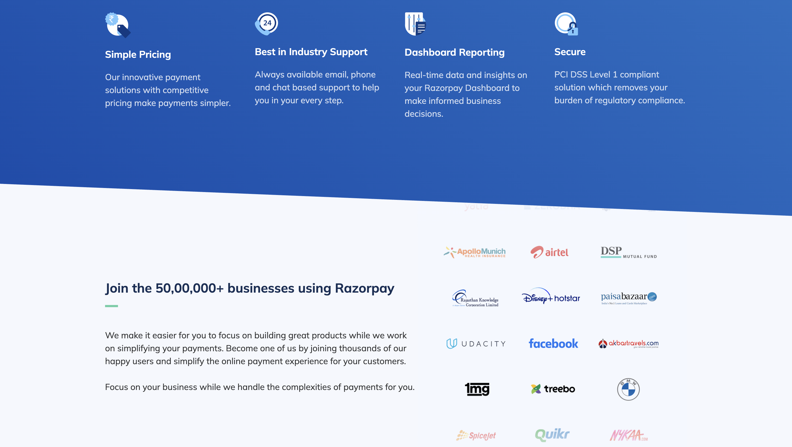

# 💳 Razorpay Homepage Clone

A frontend-only clone of the Razorpay homepage built using **HTML** and **Tailwind CSS**.  
This project was made to practice responsive layouts, utility-first styling, and pixel-perfect UI recreation.

## 🚀 Live Demo

🔗(https://learning-payment-clone.vercel.app/)

## 📂 GitHub Repo

🔗(https://github.com/FluxHarsh/Learning-Payment-Clone)

## 📸 Preview




## ✨ Features

- Clean and modern UI inspired by Razorpay
- Responsive design for mobile, tablet, and desktop
- Hover effects and smooth transitions
- Utility-first styling with Tailwind CSS
- Fully static – no JavaScript or backend logic

## 📚 Tech Stack

- HTML5
- Tailwind CSS 

## 📌 Purpose

This project was built as part of my frontend learning journey — to improve layout building skills and understand how professional websites are structured.

## 📦 How to Use

1. Clone this repository:
   ```bash
   git clone https://github.com/FluxHarsh/Learning-Payment-Clone.git
Open index.html in your browser or live server.

No build tools or dependencies required.

✅ Status

✅ Completed – No backend or interactivity planned (pure frontend clone).

🙋‍♂️ Author
Harsh Jagtap

🔗 Portfolio (Coming Soon)

🔗 LinkedIn:https://www.linkedin.com/in/harsh--jagtap/

🔗 Twitter:https://x.com/HarshJagtap843

📌 Note
This project is for educational purposes only. All rights to the original Razorpay design belong to Razorpay.
